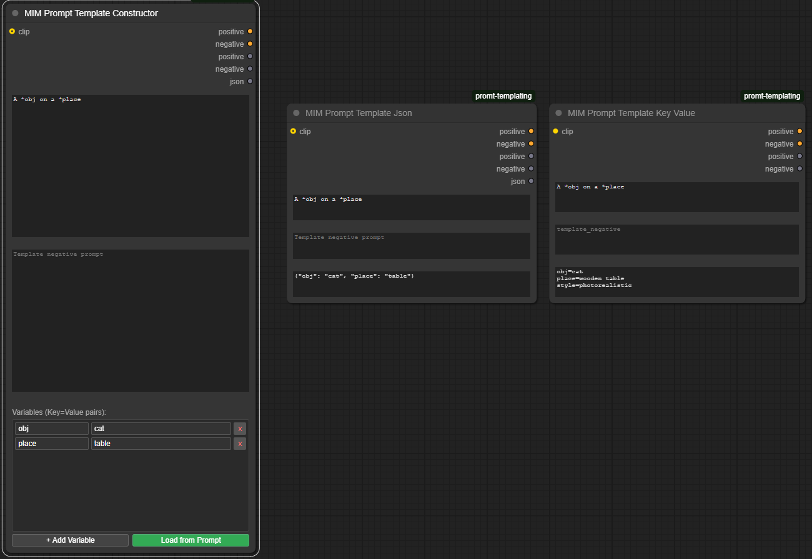
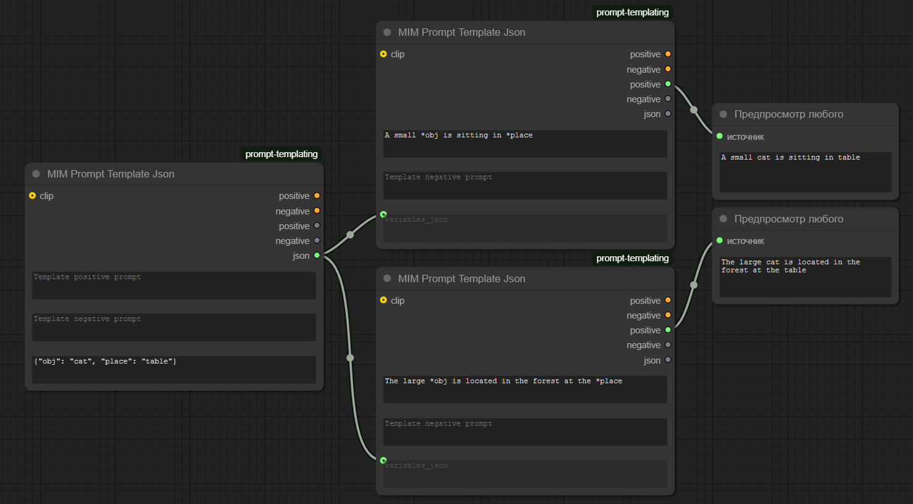

# ComfyUI Prompt Template

Easily replace variables like `*obj` or `*style` in your prompts using templates.

## Features

- Supports `*variable` syntax in positive/negative prompts
- Two input modes:
  - **JSON** (with custom UI: dynamic key/value fields + "Load from Prompt" button)
  - **Key=Value** (simple multiline text)
- Auto-detects variables from prompt text
- Outputs both conditioning and raw prompts



## Installation

1. Navigate to your `ComfyUI/custom_nodes` folder
2. Clone this repository:
```bash
git clone https://github.com/DaniilVdovin/ComfyUI-prompt-templating.git
```
3. Restart ComfyUI

## Usage

### 🧩 Prompt Template (JSON)

Add the MIM Prompt Template Json node
Write a prompt like: A `*character` in `*outfit` on `*background`
Add fields to json string
Connect to KSampler

Example Workflow:


### 🧩 Prompt Template (Key=Value)

Use MIM Prompt Template Key Value
Enter variables as:
1. `character=cyberpunk robot`
2. `outfit=neon armor`
3. `background=city at night`

Example Workflow:


### 🧩 Prompt Template (Constructor)

Use MIM Prompt Template Constructor
Write a prompt like: A `*character` in `*outfit` on `*background`
Click "Load from Prompt" to auto-create fields for character, outfit, background

Issues: I can't display this node correctly in a smaller view; it only looks good in a larger view.

Example Workflow:


### 🧩 Features on using multiple nodes at once:

JSON nodes can be freely combined with each other to get different results, such as different values for the same key, different keys for the same value, and so on. Here is a small example of implementation 
> (this also works with the constructor, as it is the same node as JSON but with an additional JS interface):

Example Workflows:

1 set of keys, 2 different prompts.

